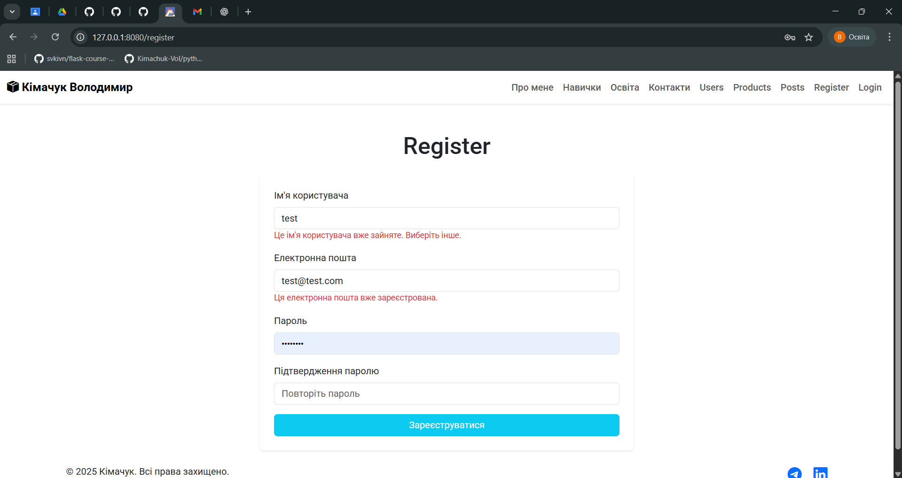
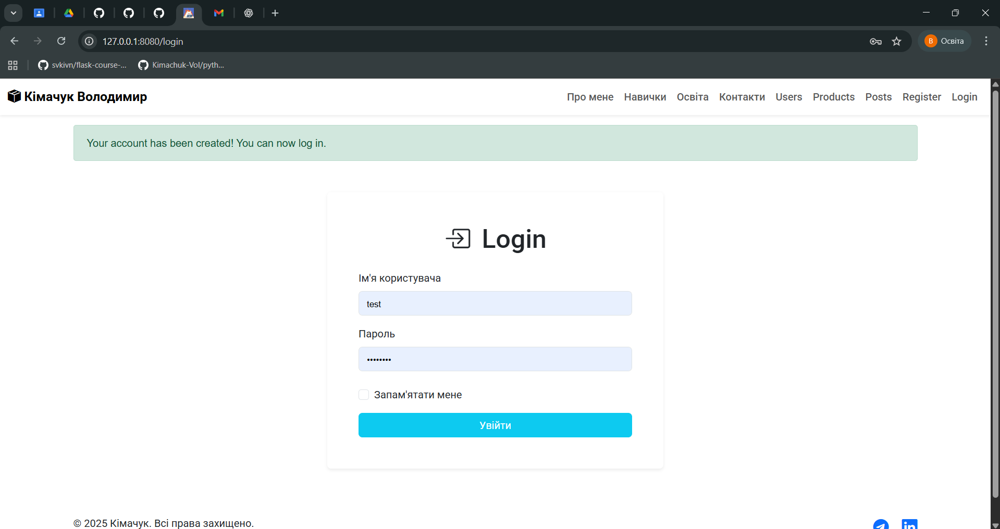
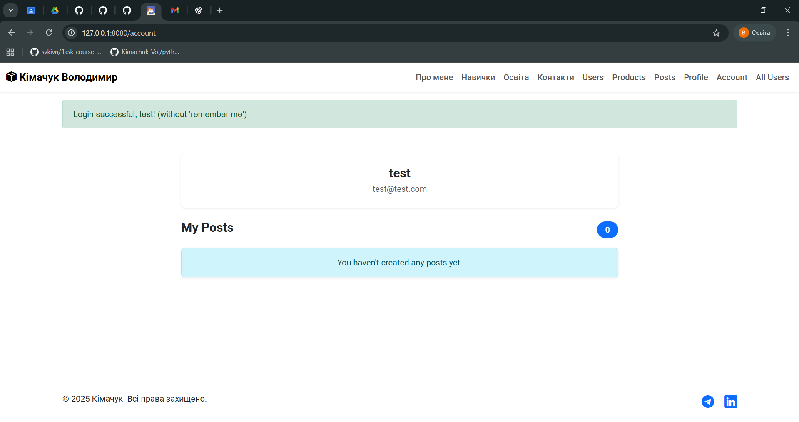
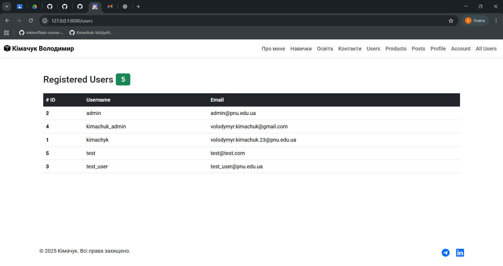
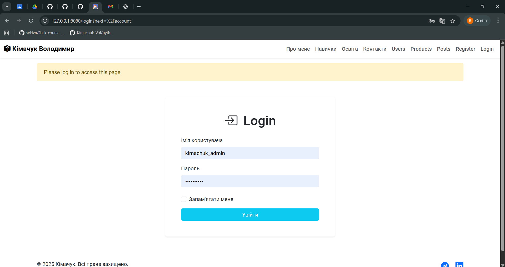

# python-flask

Web Programming with Python

*registration page*

*login page flash success registration*

*login success*

*list of all users*

*login require for access (flask_login)*

*database user table*

*tests success*
