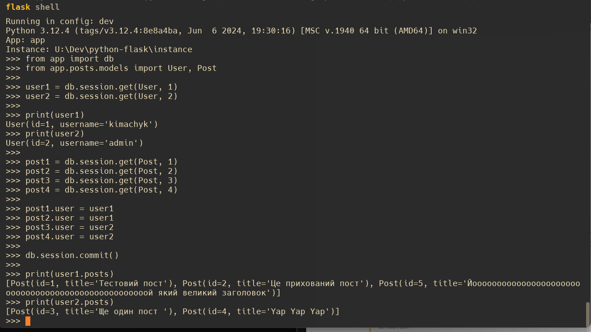
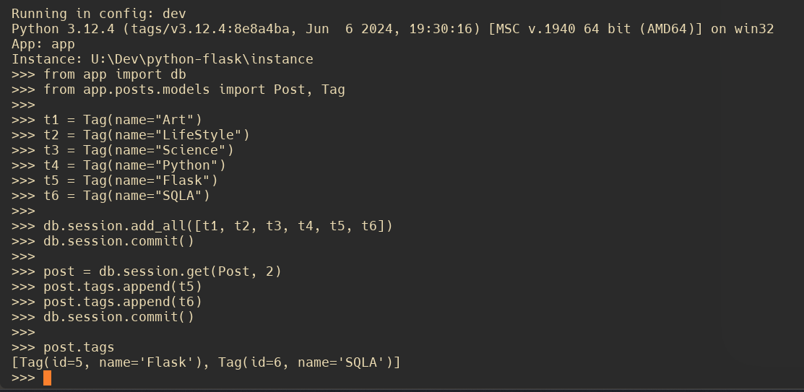
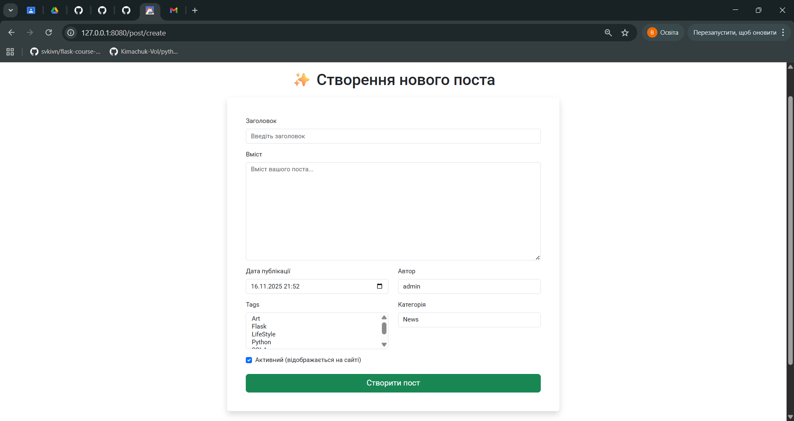
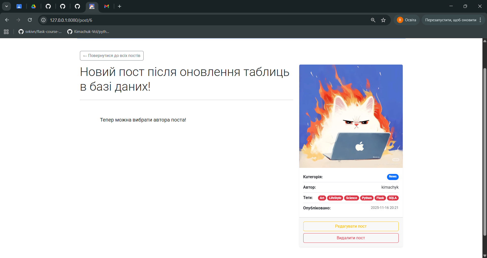

# python-flask

Web Programming with Python

*показ постів та їх авторів через flask shell*

*добавлення тегів через flask shell*

*сторінка створення поста*

*сторінка поста з тегами і автором*
